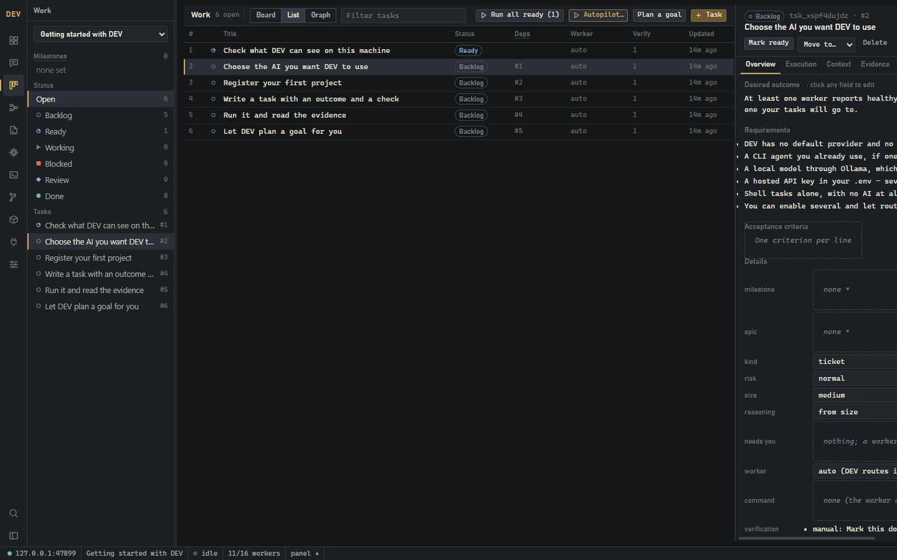
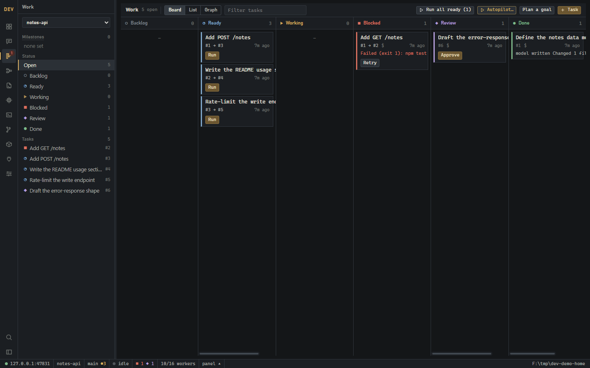
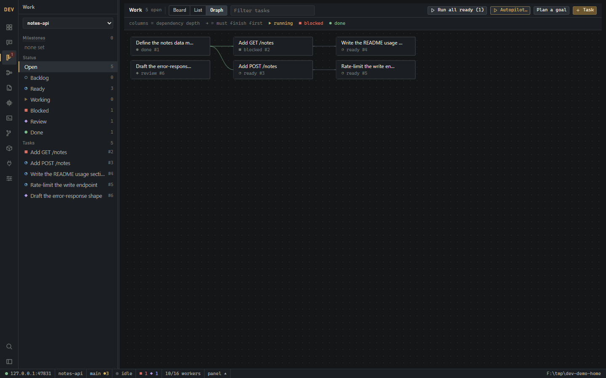
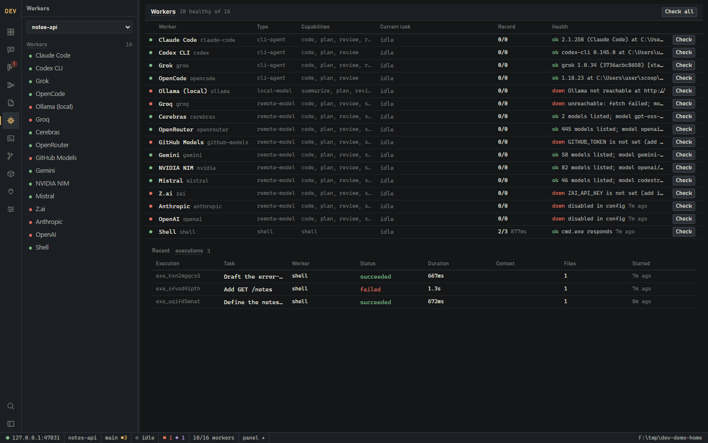
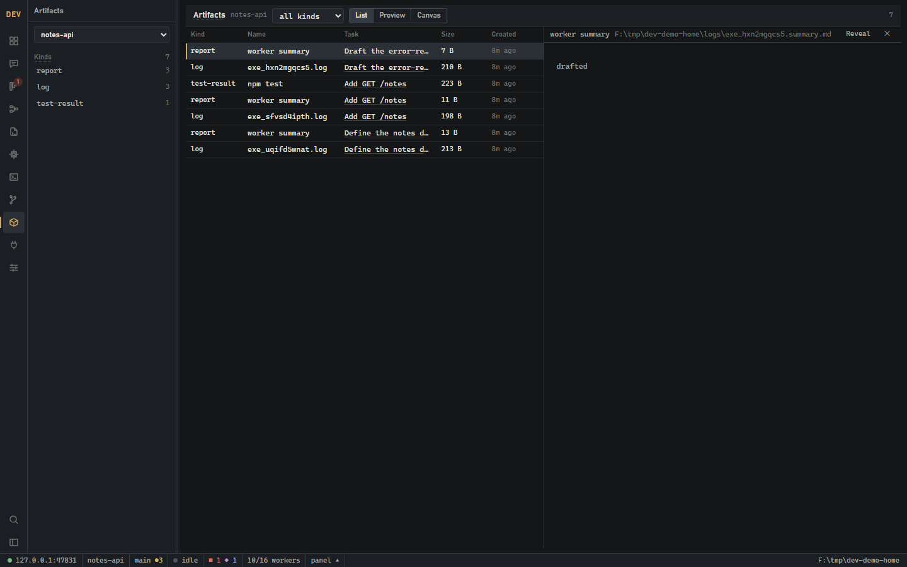
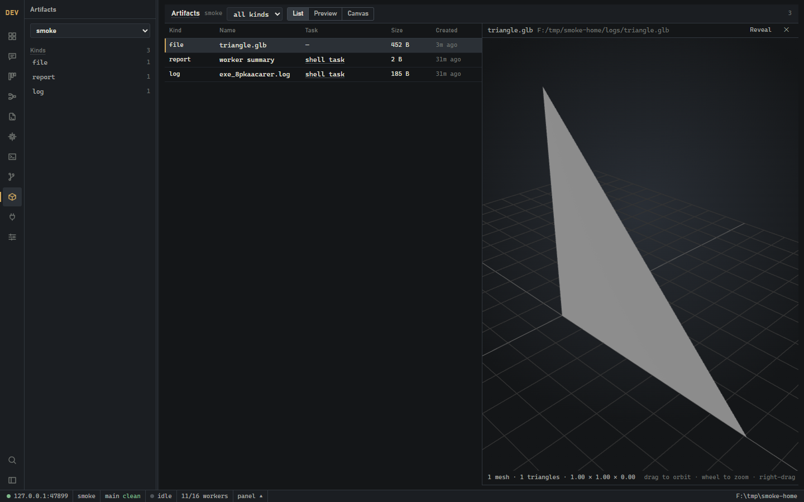

<h1 align="center">DEV</h1>

<p align="center">
  <strong>A local development operating system.</strong><br>
  Give it a goal. It plans the work, routes each task to whichever AI you have,<br>
  runs it, verifies the result, and keeps the evidence.
</p>

<p align="center">
  <a href="https://github.com/LeightonMees/dev-os/actions/workflows/ci.yml"></a>
  <a href="LICENSE"></a>
  
  
  
</p>

<p align="center">
  <a href="#screenshots">Screenshots</a> ·
  <a href="#works-with-the-ai-you-already-have">Any AI</a> ·
  <a href="#install">Install</a> ·
  <a href="#safety">Safety</a> ·
  <a href="docs/ARCHITECTURE.md">Architecture</a>
</p>

---

DEV knows how to develop; it does not know in advance what will be developed. You give it a goal, it
breaks it into tasks with dependencies, routes each task to whichever AI worker you have available,
runs it, verifies the result, and records the evidence.

Everything runs on your machine. Your code stays in your repositories, your database is a SQLite file
in a folder you own, and nothing is sent anywhere except the bounded context you configure a provider
to receive.

```
goal → plan → tasks (with dependencies) → select worker → execute → verify → evidence → DONE
```

Two first-class interfaces over one core:

- **`dev`** — a CLI that is enough on its own.
- **DEV desktop** — a Tauri + React workbench: board, list and dependency-graph views, an inspector,
  live output, a real terminal, git, a flow editor, and an artifact zone with a 3D viewport.

Both talk to the same control plane and the same database, so anything created in one appears in the
other immediately.

## Screenshots

> Real screens from a real database — including a task that genuinely failed, and providers honestly
> reported as unreachable because there is no key for them. Nothing here is a mock-up.



<p align="center"><em><strong>First run</strong> — a new install explains itself as real tasks, with dependencies, so the guide is also a demonstration. No provider is named as required.</em></p>

| | |
|---|---|
|  |  |
| **Work** — every task by status. Drag between the columns the state machine allows; the rest explain why they refuse. | **Graph** — columns are dependency depth, so work reads left to right. |
|  |  |
| **Workers** — 16 of them, which are healthy, and the real reason the rest are not. | **Artifacts** — every file a run produced, rendered in place and editable. |
|  | |
| **3D viewport** — GLB/GLTF artifacts drawn as meshes: orbit, zoom, pan, with counts read from the loaded scene. | |

## What makes it different

**It never fabricates.** A control that cannot work is disabled with a reason. A number on screen
came from a measurement. A task cannot reach DONE without evidence — a command exit code, a file that
exists, a passing check, or your explicit approval. This is the whole point: supervising automated
work is worthless if the display cannot be trusted.

**It is honest about failure.** When a task fails it goes to BLOCKED with a structured reason and a
next action, not a shrug.

**Workers are interchangeable.** A task says what it needs; routing picks a healthy worker that can
do it. If one provider is rate-limited, another takes the work.

**Unattended runs stop at the edge of your machine.** With `git.isolation: worktree` every run gets
its own git worktree and branch, so a worker can never leave your checkout half-edited. Pushes wait
for your approval by default; so does any command containing `git push`, `npm publish`, `rm -rf` or
whatever else you list. Approving performs the action; denying blocks the task with your reason.

## Works with the AI you already have

DEV has no favourite model, and no provider is required — it will run shell tasks and local models
with no account anywhere.

**CLI agents** (if installed): [Claude Code](https://claude.com/claude-code), [Codex
CLI](https://github.com/openai/codex), Grok CLI, OpenCode.

**Local models:** [Ollama](https://ollama.com) — nothing leaves your machine.

**Hosted APIs**, any OpenAI-compatible endpoint. These ship with a free tier and are enabled once a
key is present: Groq, Cerebras, OpenRouter, GitHub Models, Google Gemini, NVIDIA NIM, Mistral, Z.ai.
These are paid and ship disabled until you turn them on: Anthropic, OpenAI.

Adding another provider is usually one line — see [CONTRIBUTING.md](CONTRIBUTING.md#adding-an-ai-provider).

## Requirements

- **Node 24+** — the core, CLI and control plane run TypeScript directly, with no build step
- **Git**
- For the desktop app only: the [Rust toolchain](https://rustup.rs) and your platform's
  [Tauri prerequisites](https://tauri.app/start/prerequisites/)

DEV is developed and used daily on **Windows 11**, and CI runs the test suite on Windows and Linux.
The core is written to be portable, but the integrated terminal and the launcher script are
Windows-first, and macOS is currently untested. Reports are welcome.

## Install

```bash
git clone https://github.com/LeightonMees/dev-os.git
cd dev-os
npm install
npm link          # puts `dev` on PATH; or use `node apps/cli/bin/dev.mjs`
dev doctor        # what is installed, what is healthy, what is missing
```

`dev doctor` is the honest starting point: it tells you which workers it can actually see, rather
than assuming.

Local state — database, logs, artifacts, config — lives in `.dev-home/` beside the repository. Set
`DEV_HOME` to put it somewhere else.

Provider keys come from your environment. Copy `.env.example` to `.env` and fill in only what you
want; every provider is optional.

## First run

```bash
dev project add /path/to/your-project         # register a repository
dev task add "Add a /health endpoint" --project your-project \
  --outcome "GET /health returns 200 JSON" --verify "npm test"
dev task run 1                                # routes to a healthy worker and runs it
dev task show 1                               # evidence, artifacts, events
dev ui                                        # the desktop app (starts the control plane too)
```

`dev plan "<goal>"` turns a goal into a small bounded task list and asks before saving it.
`dev auto` runs everything runnable in dependency order, handing each task the outcomes of the tasks
it depends on.

## Safety

DEV runs commands on your machine with your permissions. Read [SECURITY.md](SECURITY.md) before
pointing it at anything you care about — in particular, the control plane is unauthenticated and safe
only because it is bound to loopback and refuses requests from any origin but its own window. Do not
expose it to a network.

Work on a branch, and keep approvals on for consequential actions until you trust it.

## Layout

```
apps/cli             the dev command
apps/control-plane   local HTTP + SSE service over the core
apps/desktop         Tauri 2 + React workbench (the PTY lives in src-tauri)
packages/core        projects, tasks, graph, workers, execution, events, context, git
tests/               integration tests: the full loop against a temporary repository
docs/                architecture, state model, CLI reference, how to extend DEV
```

`packages/core` owns everything that matters; the CLI and the app are clients. See
[docs/ARCHITECTURE.md](docs/ARCHITECTURE.md).

## Verify

```bash
npm test               # core, CLI, control plane, integration (node --test)
npm run test:desktop   # component tests (vitest)
npm run typecheck
npm run lint
npm run check          # all of the above — required before a pull request
```

## Status

Pre-1.0 and honest about it. It is used daily by its author, the test suite is real, and the
architecture is settled — but interfaces still move, and there has been no release with backported
fixes. [ROADMAP.md](ROADMAP.md) is the only backlog and is deliberately short.

Bugs and questions are welcome in the issue tracker; security issues go through the private process
in [SECURITY.md](SECURITY.md).

## Licence

[Apache License 2.0](LICENSE).
